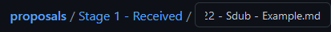

# 📣 Proposals

Proposals may be submitted using the following process. Once your proposal is submitted, it will be published to the Boss DAO GitHub and publicly accessible.

Your proposal will then be vetted by the Boss DAO community on discord. If general consensus is that a vote should be held, the Boss DAO development team will organize and begin the vote.

**Step 0.**

Create a GitHub account: [https://github.com/join](https://github.com/join)

**Step 1.**

Go to [https://github.com/boss-dao/proposals](https://github.com/boss-dao/proposals)

**Step 2.**

Click "fork" in the top right of the page

.png>)

**Step 3.**

A new window that looks like this will appear

.png>)

**Step 4.**

Click the "Received" folder

.png>)

**Step 5.**

Click "Add File" and "Create New File" in the upper right of the window

.png>)

**Step 6.**

A new window that looks like this will appear

.png>)\
**Step 7.**

Open [https://github.com/boss-dao/proposals/blob/main/Proposal%20Template.md ](https://github.com/boss-dao/proposals/blob/main/Proposal%20Template.md)in a new window

**Step 8.**

Click "Raw" in the upper right section of the window

.png>)

**Step 9.**

A copy/paste-able version of the proposal template appears. Press CTRL+a to highlight the entire page, and CTRL+c to copy the entire page. Alternatively, use your mouse cursor to highlight everything manually.

**Step 10.**

Return to the window with your new proposal and paste the proposal template in the “edit new file” box by pressing CTRL+v

.png>)

**Step 11.**

Add a date, title, and author to your proposal. Example: 03-22-2022 - Sdub - Example.md. **Make sure to add .md to the end of the name.** **Make sure to use MM-DD-YYYY date format**

********

**Step 12**.

Edit the proposal template to your liking. Preview the document by pressing the preview button

.png>)

If your preview text looks like this font, then you probably forgot the .md at the end of your proposal name

.png>)

To fix, press the “edit new file” button and add .md at the end of your proposal name

.png>)

Then go back to your preview. The font should be much prettier

S**tep 13.**

Once you’ve finished writing your proposal, commit your proposal at the bottom of the window Commit directly to main branch.

.png>)

**Step 14.**

Navigate to [https://github.com/boss-dao/proposals/pulls](https://github.com/boss-dao/proposals/pulls)

**Step 15.**

Click "new pull request" in the top right

.png>)

**Step 16.** Click "compare across forks"

.png>)\
**Step 17.**&#x20;

Select your version of the proposal repository

.png>)

**Step 18.**&#x20;

Click "create pull request"

.png>)

**Step 19.**

Title your pull request and submit

.png>)

**Step 20.**&#x20;

The team will accept your proposal and it will be displayed for DAO members to read at [https://github.com/boss-dao/proposals](https://github.com/boss-dao/proposals)

**Why Markdown (.md) files only?**

Other file formats such as PDF (.pdf) and Word (.docx) are **regularly discovered to be exploitable.** These proposals will be read by many people with cryptocurrency wallets. **The Boss DAO development team does not want to take the risk of a malicious actor using the proposal process as an attack vector against the DAO or DAO members.** Markdown files are much safer by comparison, and still facilitate the proposal process well.

If you are unfamiliar with markdown, there are many free resources online. The development team has tried to make the proposal template as easy as possible to modify. We apologize for the inconvenience markdown may cause you at first - **security often comes at the sacrifice of convenience.**
